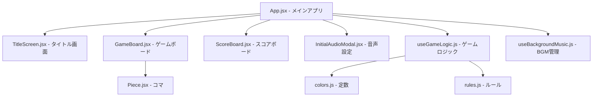

# TRYPASゲーム Webアプリケーション システム仕様書

**バージョン:** 1.3  
**作成日:** 2025-11-29  
**最終更新:** 2025-12-11  
**プロジェクト名:** TRYPAS Web Application

---

## 1. システム概要

### 1.1 目的
トライパスボードゲームをWebブラウザ上でプレイ可能にするアプリケーションの開発。プレイヤーは対戦モード（ローカル2人対戦、CPU対戦）およびソロモードでゲームを楽しむことができる。

### 1.2 主な機能
- タイトル画面（ゲームモード選択、ルール説明）
- ゲームプレイ画面（盤面、スコアボード、操作ボタン）
- ローカル2人対戦モード
- CPU対戦モード（3段階の難易度: EASY, NORMAL, HARD）
- ソロモード（1人プレイ）
- ゲームルールの表示（"TRYPAS SOLOPLAYの遊び方"）
- スコア計算と勝敗判定
- **時間管理機能**（ソロ: 経過時間、対戦: 思考時間）
- **リプレイ機能**（試合の振り返り）
- **再戦機能**（ネクストプレイ、同じ盤面でのプレイ）
- **改善された終了時表示**（盤面が見える状態でスコア表示）
- **サウンド機能**（BGM/SE再生、音量調節、初期設定モーダル）

### 1.3 技術スタック

| 技術要素 | 使用技術 |
|---------|---------|
| フロントエンド | React 19.2.0 |
| ビルドツール | Vite 7.2.4 |
| スタイリング | TailwindCSS 3.4.18 |
| アニメーション | Framer Motion 12.23.24 |
| JavaScript | ES6+ (Modules) |
| パッケージマネージャ | npm |

---

## 2. システムアーキテクチャ

### 2.1 プロジェクト構成

```
trypas-web/
├── index.html              # エントリーポイント
├── package.json            # 依存関係管理
├── vite.config.js          # Vite設定
├── tailwind.config.js      # Tailwind設定
├── postcss.config.js       # PostCSS設定
├── src/
│   ├── main.jsx           # Reactアプリケーションエントリー
│   ├── App.jsx            # メインアプリケーションコンポーネント (Audio State管理含む)
│   ├── App.css            # アプリケーション固有スタイル
│   ├── index.css          # グローバルスタイル
│   ├── components/
│   │   ├── TitleScreen.jsx        # タイトル画面コンポーネント
│   │   ├── GameBoard.jsx          # ゲームボードコンポーネント
│   │   ├── ScoreBoard.jsx         # スコアボードコンポーネント
│   │   ├── Piece.jsx              # コマコンポーネント
│   │   └── InitialAudioModal.jsx  # 初期音声設定モーダル
│   ├── hooks/
│   │   ├── useGameLogic.js        # ゲームロジックカスタムフック
│   │   └── useBackgroundMusic.js  # BGM管理カスタムフック
│   └── constants/
│       ├── colors.js          # カラーと得点定義
│       └── rules.js           # ボードレイアウトとルール定義
└── public/                # 静的アセット (sounds/ 含む)
```

### 2.2 コンポーネント構造



---

## 3. ゲームルール仕様

### 3.1 基本ルール

#### 3.1.1 ボード構成
- **ボードサイズ:** 15箇所の配置スポット（三角形配置）
- **レイアウト:**
```
       0
      1 2
     3 4 5
    6 7 8 9
 10 11 12 13 14
```

#### 3.1.2 コマの種類と得点

| 色 | カラーコード | 得点 | 個数 |
|---|------------|------|------|
| 赤 (RED) | #FF6B6B | 10点 | 3個 |
| 黄 (YELLOW) | #FFE66D | 20点 | 3個 |
| 緑 (GREEN) | #4ECDC4 | 30点 | 3個 |
| 青 (BLUE) | #45B7D1 | 40点 | 3個 |
| 白 (WHITE) | #F7FFF7 | 50点 | 3個 |

**合計:** 15個のコマ

#### 3.1.3 ゲームフェーズ

1. **初期配置フェーズ (REMOVING)**
   - ゲーム開始時、15個のコマがランダムに配置される
   - 先手プレイヤーがコマを1つ取り除く
   - フェーズが「PLAYING」に移行

2. **プレイフェーズ (PLAYING)**
   - プレイヤーが交互にターンを行う
   - コマを選択し、他のコマを飛び越えて移動
   - 飛び越えたコマの最後の1つを取得

3. **ゲーム終了フェーズ (GAME_OVER)**
   - 移動可能な手がなくなった時点で終了
   - スコアの高いプレイヤーが勝利

### 3.2 移動ルール

#### 3.2.1 有効な移動
- **直線上の移動のみ:** ボード上の直線（水平、左斜め、右斜め）に沿って移動
- **ジャンプ条件:**
  - 1個〜3個のコマを連続で飛び越える
  - 着地点は空のスポットである必要がある
  - 飛び越えたコマの最後の1つ（着地点に最も近いコマ）のみを取得

#### 3.2.2 特殊ルール
- **赤コマボーナス:** 赤コマを取得した場合、同じプレイヤーがもう1ターン実行できる
- **勝敗条件:** 移動できなくなったプレイヤーの負け

### 3.3 ボードの直線定義

#### 水平線
- `[0]`（トップ）
- `[1, 2]`
- `[3, 4, 5]`
- `[6, 7, 8, 9]`
- `[10, 11, 12, 13, 14]`

#### 右上から左下への斜め線
- `[0, 2, 5, 9, 14]`
- `[1, 4, 8, 13]`
- `[3, 7, 12]`
- `[6, 11]`

#### 左上から右下への斜め線
- `[0, 1, 3, 6, 10]`
- `[2, 4, 7, 11]`
- `[5, 8, 12]`
- `[9, 13]`

---

## 4. 機能仕様

### 4.1 タイトル画面 (TitleScreen.jsx)

#### 4.1.1 機能
- ゲームタイトル表示
- ゲームモード選択ボタン
  - **LOCAL:** ローカル2人対戦
  - **CPU - EASY:** CPU対戦（簡単）
  - **CPU - NORMAL:** CPU対戦（通常）
  - **CPU - HARD:** CPU対戦（難しい）
  - **SOLO:** ソロモード（1人プレイ）
- ルール説明モーダル（タイトル: "TRYPAS SOLOPLAYの遊び方"、🎮アイコンなし）
- アニメーション効果（Framer Motion使用）

#### 4.1.2 UI要素
- グラデーション背景
- ボタンホバーエフェクト
- モーダルウィンドウ（ルール説明）

### 4.2 ゲーム画面

#### 4.2.1 スコアボード (ScoreBoard.jsx)
- プレイヤー別スコア表示
- 現在のターン表示
- ゲームフェーズ表示
- アクションメッセージ表示（赤コマボーナス通知など）
- **時間表示機能**
  - ソロモード: 経過時間（MM:SS形式）
  - 対戦モード: 思考時間（MM:SS形式）
- リプレイモード表示

#### 4.2.2 ゲームボード (GameBoard.jsx)
- 15箇所のスポット表示
- コマの視覚表示
- スポット選択時のハイライト
- 有効な移動先の表示
- アニメーション効果

#### 4.2.3 操作ボタン
- **TITLE:** タイトル画面に戻る
- **RESET:** ゲームをリセット
- **ルール説明:** ゲーム中にルールを確認
- **音量ボタン:** 右上に配置、クリックで音量メニュー展開（大・小・消）

#### 4.2.4 終了時表示バナー
- **盤面の下にバナー形式で表示**（盤面を隠さない改善）
- 勝者の表示
- 最終スコア表示
- リプレイボタン（対戦モードのみ）
- もう一度/タイトルへ戻るボタン

#### 4.2.5 リプレイ機能
- **手順の再生機能**
  - 前へ/次へボタンで手順を移動
  - リプレイ終了ボタン
- **記録される情報**
  - 各手の盤面状態（before/after）
  - プレイヤー情報
  - 取得したコマと得点
  - 思考時間
  - タイムスタンプ

### 4.3 ゲームロジック (useGameLogic.js)

#### 4.3.1 状態管理
- `board`: ボードの状態（15要素の配列）
- `turn`: 現在のターン（1 or 2）
- `scores`: プレイヤー別スコア `{ p1: number, p2: number }`
- `phase`: ゲームフェーズ（'REMOVING' | 'PLAYING' | 'GAME_OVER'）
- `selectedSpot`: 選択中のスポット
- `validMoves`: 有効な移動先のリスト
- `winner`: 勝者（null | 1 | 2 | 'SOLO'）
- `lastActionMessage`: アクションメッセージ
- **`elapsedTime`: 経過時間（秒単位、ソロモード用）**
- **`turnStartTime`: ターン開始時刻**
- **`turnTime`: 現在のターンの思考時間（秒単位）**
- **`moveHistory`: 手順履歴（リプレイ用）**
- **`isReplaying`: リプレイモードフラグ**
- **`replayStep`: リプレイの現在ステップ**

#### 4.3.2 主要関数

##### `initializeBoard(preservedBoard)`
- ボードを初期化し、コマをランダムに配置
- `preservedBoard`が渡された場合はその配置を使用（同じ盤面でのプレイ）
- スコアとフェーズをリセット

##### `getValidMoves(spotIndex, currentBoard)`
- 指定されたスポットから可能な移動を計算
- 直線上の移動を考慮
- 1〜3個のコマを飛び越える移動を検証

##### `checkAnyMovePossible(currentBoard)`
- ボード全体で移動可能な手があるかチェック
- ゲーム終了判定に使用

##### `executeMove(move)`
- 選択された移動を実行
- コマを移動し、取得したコマを削除
- スコアを更新
- 赤コマボーナスをチェック
- ゲーム終了をチェック

##### `handleSpotClick(index)`
- スポットクリック時の処理
- フェーズに応じた処理の分岐
  - REMOVING: コマ削除
  - PLAYING: コマ選択または移動実行

#### 4.3.3 CPU対戦ロジック

##### CPU - EASY
- ランダムに移動を選択

##### CPU - NORMAL
- 得点の高いコマを優先的に狙う

##### CPU - HARD
- 赤コマを最優先
- 次に得点の高いコマを狙う

### 4.4 オーディオ管理 (useBackgroundMusic.js & App.jsx)

- **`useBackgroundMusic` フック:**
  - Audioオブジェクトの生成と管理
  - `play`, `pause`, `setVolume`, `toggleMute` メソッドの提供
  - メモリリーク防止（クリーンアップ処理）
  - フック戻り値のメモ化による再レンダリング防止
- **`InitialAudioModal` コンポーネント:**
  - 初回アクセス時にユーザーの意思を確認
  - localStorageへの設定保存（次回以降のスキップ）
- **グローバル制御:**
  - `App.jsx` でBGMインスタンスを保持し、画面遷移またぎで再生制御
  - シーンに応じたBGMの切り替え（タイトル↔ゲーム）

---

## 5. データ構造

### 5.1 ボード状態
```javascript
// ボードは15要素の配列
// 各要素は null または色文字列
board: Array<null | 'RED' | 'YELLOW' | 'GREEN' | 'BLUE' | 'WHITE'>

// 例:
[
  'RED', 'YELLOW', null, 'BLUE', 'GREEN',
  'WHITE', null, 'RED', 'YELLOW', 'BLUE',
  'GREEN', 'WHITE', null, 'RED', 'YELLOW'
]
```

### 5.2 移動データ
```javascript
{
  start: number,        // 開始スポットのインデックス
  end: number,          // 着地スポットのインデックス
  captured: number[]    // 飛び越えたスポットのインデックス配列
}
```

### 5.3 スコアデータ
```javascript
{
  p1: number,  // プレイヤー1のスコア
  p2: number   // プレイヤー2のスコア
}
```

---

## 6. UI/UXデザイン仕様

### 6.1 デザインコンセプト
- **ダークモード:** 全体的にダークグレー基調
- **ビビッドカラー:** コマには鮮やかな色を使用
- **グラスモーフィズム:** 半透明のパネル、バックドロップブラー
- **スムーズアニメーション:** Framer Motionによる画面遷移
- **リッチテキスト:** グラデーション文字などを使用した見出し

### 6.2 カラーパレット

#### 背景
- メイン背景: `bg-gray-900` (#111827)
- パネル背景: `bg-gray-800` (#1F2937)
- ボーダー: `border-gray-700` (#374151)

#### アクセントカラー
- 選択ハイライト: `bg-pink-500`
- グラデーション: `from-blue-400 to-purple-600`

#### コマカラー
- 赤: `#FF6B6B`
- 黄: `#FFE66D`
- 緑: `#4ECDC4`
- 青: `#45B7D1`
- 白: `#F7FFF7`

### 6.3 アニメーション

#### 画面遷移
- フェードイン/アウト
- スケールアニメーション
- ブラーエフェクト

#### ボタン
- ホバー時のスケール変化
- トランジション効果

#### モーダル
- バックドロップのフェード
- パネルのスライド＆スケール

---

## 7. 開発環境

### 7.1 必要なツール
- Node.js (v16以上推奨)
- npm (v7以上推奨)
- モダンブラウザ（Chrome, Firefox, Safari, Edge最新版）

### 7.2 セットアップ手順
```bash
# 依存関係のインストール
npm install

# 開発サーバー起動
npm run dev

# 本番ビルド
npm run build

# プレビュー
npm run preview
```

### 7.3 ビルド構成
- **開発サーバー:** Vite Dev Server (ホットリロード対応)
- **本番ビルド:** 最適化されたバンドル（dist/）
- **Linting:** ESLint

---

## 8. 非機能要件

### 8.1 パフォーマンス
- 初回ロード時間: 3秒以内
- スポットクリックからの反応速度: 100ms以内
- アニメーションフレームレート: 60fps

### 8.2 互換性
- モダンブラウザ対応（ES6+）
- レスポンシブデザイン対応
- タッチデバイス対応

### 8.3 保守性
- コンポーネント単位の分割
- カスタムフックによるロジック分離
- 定数の外部ファイル管理

---

## 9. 今後の拡張可能性

### 9.1 考えられる機能追加
- オンライン対戦機能
- プレイヤープロフィール登録
- ランキングシステム
- リプレイの自動再生機能
- リプレイの保存・共有機能
- カスタム陣形作成
- 多言語対応
- アクセシビリティ向上

### 9.2 技術的改善
- TypeScript導入
- ユニットテスト追加
- E2Eテスト導入
- PWA対応
- バックエンドAPI連携

---

## 10. 用語集

| 用語 | 説明 |
|-----|------|
| トライパス | 赤コマを取得してエクストラターンを得ること |
| スポット | ボード上のコマ配置位置（15箇所） |
| ジャンプ | コマを飛び越える移動 |
| キャプチャ | コマを取得すること |
| フェーズ | ゲームの進行段階（REMOVING, PLAYING, GAME_OVER） |

---

## 11. 変更履歴

| バージョン | 日付 | 変更内容 | 担当者 |
|----------|------|---------|--------|
| 1.0 | 2025-11-29 | 初版作成 | - |
| 1.1 | 2025-12-10 | 時間管理機能追加、リプレイ機能追加、終了時表示改善 | - |
| 1.2 | 2025-12-11 | サウンドシステム追加、コンポーネント構成更新 | アンチグラビティ |
| 1.3 | 2025-12-11 | 同じ盤面でのリプレイロジック追加、UI微調整 | アンチグラビティ |

---

**文書終了**
