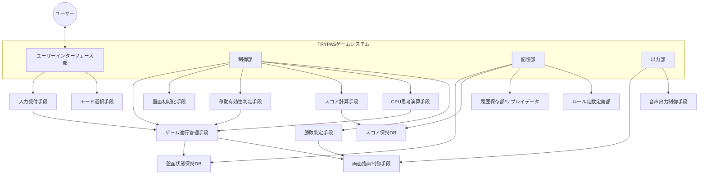
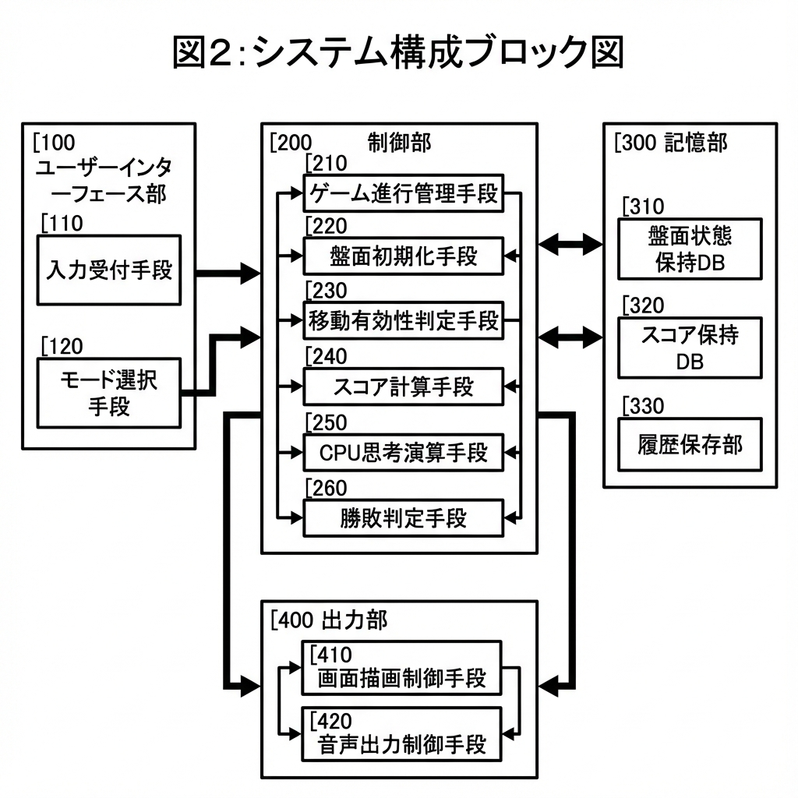
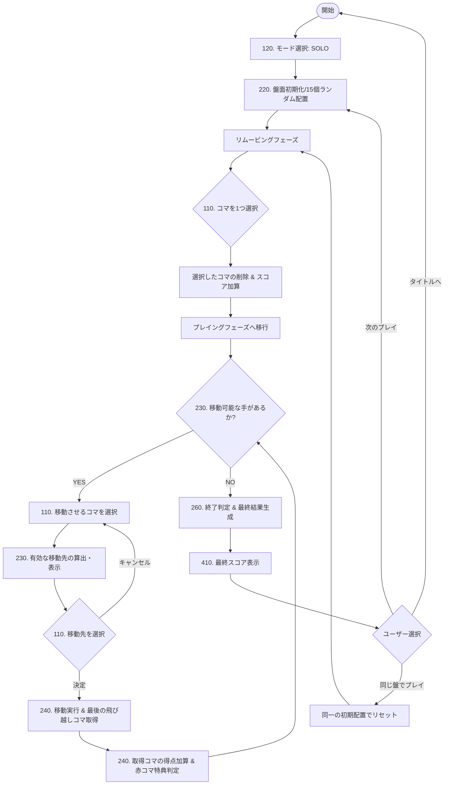
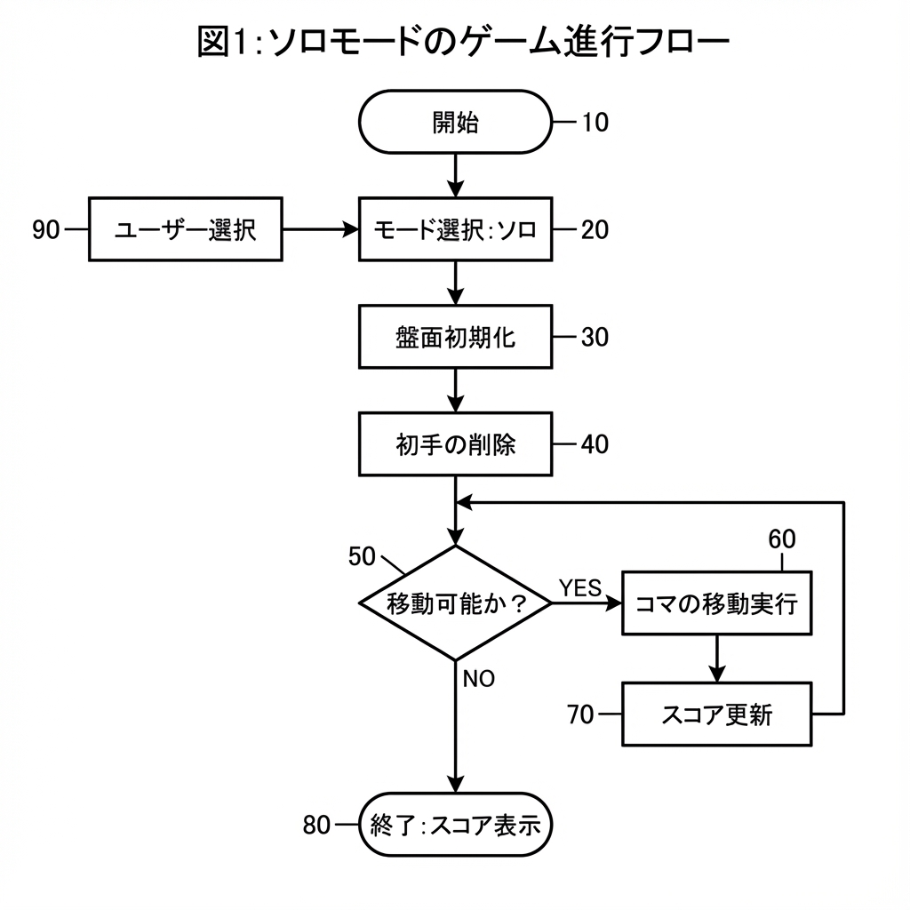

# TRYPASゲームシステム特許用説明資料

本資料は、TRYPAS（トライパス）ゲームシステムの特許申請における「システムの構造」および「各構成要素の機能」を記述したものです。

---

## 1. システム構成ブロック図

以下のブロック図は、本システムの全体構造と主要な機能ユニットの関係を示しています。

### 【図面】システム構成ブロック図

---

## 2. 各構成ユニットの詳細説明

### 100. ユーザーインターフェース部
ユーザーとシステムとの情報のやり取りを管理するインターフェース層です。
- **110. 入力受付手段**: 表示装置（タッチパネル、マウス等）を介した座標情報を受け取り、特定のゲームスポット（0-14番）への指示として変換します。
- **120. モード選択手段**: ローカル対戦、ソロプレイ、CPU対戦（難易度別）などの動作モードを選択させ、システム全体の動作パラメータを決定します。

### 200. 制御部（演算処理エンジン）
本システムの核となるロジックを実行するプロセッサ群です。
- **210. ゲーム進行管理手段**: 「リムービング（配置後の1個削除）」から「プレイング（交互の移動）」、そして「終了判定」に至る一連のシーケンスを制御します。
- **220. 盤面初期化手段**: 5色×3個の計15個のオブジェクトを、物理的な偏りがないよう疑似乱数を用いて15箇所のノードに自動配置します。
- **230. 移動有効性判定手段**: 選択された始点から終点までの直線パス（水平・斜め）を計算し、その間に1〜3個のコマが存在し、かつ着地点が空（null）であるかを判定します。
- **240. スコア計算手段**: 取得されたコマの種類（色）に対応する点数を定数テーブルから参照し、加算します。特に「赤コマ取得時の追加ターン」という論理フラグの制御も行います。
- **250. CPU思考演算手段**: 盤面の現在の状態空間を探索し、設定された難易度に応じた評価関数を用いて、次の一手を決定します。
- **260. 勝敗判定手段**: 全ての持ち駒と空きスポットの組み合わせに対し、移動可能グラフを走査し、有効な手順が消失したことをもって終了を検知します。

### 300. 記憶部
各種データを持続的に保持、または一時的に展開するメモリ領域です。
- **310. 盤面状態保持DB**: 15要素の配列として実装され、各要素はコマの属性（色、ID）または空状態を保持します。
- **320. スコア保持DB**: リアルタイムに変動する各プレイヤーの得点データを数値形式で保持します。
- **330. 履歴保存部（リプレイデータ）**: 試合開始から終了までの全オペレーション（どのスポットからどのスポットへ移動したか）をタイムスタンプと共にスタック構造で保存します。
- **340. ルール定数定義部**: ボードの接続トポロジー（どのスポットが一直線か）や、各色の基本得点などの静的データを保持します。

### 400. 出力部
処理された情報をユーザーに還元するプレゼンテーション層です。
- **410. 画面描画制御手段**: 制御部からの状態変更を受け取り、ブラウザまたは専用デバイスの表示領域にグラフィカルに描画します（スポットの強調、移動アニメーション等）。
- **420. 音声出力制御手段**: イベント駆動形式で、移動、キャプチャ、勝利、敗北に対応するオーディオアセットを再生制御します。

---

## 3. ゲーム進行フロー図（SOLOPLAY）

SOLOPLAYモードにおける、ゲーム開始から終了、および再試行に至る論理フローを以下に示します。

### 【図面】ソロモードのゲーム進行フロー

---

## 4. 各フローステップの処理内容

### 盤面初期化・リムービング（開始処理）
1.  **モード確定**: ユーザーが「SOLO」を選択すると、1人プレイ専用のフラグが制御部にセットされます。
2.  **配置アルゴリズム**: データベースに登録された色（得点）情報をランダムにシャッフルし、15の座標（ノード）へ割り当てます。
3.  **任意削除**: 最初の「1手」として、プレイヤーが任意のコマを1つ選んで盤面から「空（null）」の状態にします（特許上の特徴：初手の自由度）。この際、削除したコマの点数も基本スコアとして加算されます。

### プレイング（メインループ）
1.  **移動可能性の常時監視**: システムは常に盤面全体をスキャンし、移動可能なコマが存在するかを判定（230）します。
2.  **有効パスの計算**: ユーザーがコマを選択した際、その中心座標から6方向（水平、上下斜め）に直線を伸ばし、「空きノード」と「その間にあるコマの数（1-3個）」を瞬時に計算し、移動候補地を明示します。
3.  **状態更新とキャプチャ**: 移動が確定すると、始点のデータを空にし、終点を移動したコマのデータで上書きします。同時に、飛び越えたパス上の「最後の反転要素（コマ）」を特定して削除し、得点処理を行います。

### ゲーム終了と再試行（終了処理）
1.  **手詰まり検知**: どのコマを選択しても「有効な移動先」が算出されない状態をプログラムが検知し、ループから離脱します。
2.  **結果の静的出力**: ゲーム終了時に結果表示モーダルを展開し、最終スコアおよび経過時間を表示してユーザーへのフィードバックを行います。
3.  **状態復元（同じ盤でプレイ）**: 本システムの記憶部（330）は、初期配置時点のシード値または配列データを保持しているため、同一の初期状態から「やり直し」を可能にする機能的特徴を持ちます。

---

## 5. 特許技術としての特徴点（参考）

1.  **動的な初期配置生成**: 15個の要素からなる1億通り以上の開始陣形を自動生成するロジック。
2.  **可変ジャンプルール**: 1個から3個までという、距離に基づかない「コマの個数」による飛び越し判定アルゴリズム。
3.  **特定のコマ（赤）によるターン制御**: スコア加算と同時にプログラムの実行権（ターンの所有権）を動的に変更する制御シーケンス。
4.  **リプレイ・再現性**: 保存されたオペレーション履歴に基づき、過去の盤面状態を完全に復元する再帰的な処理。

---
**作成日:** 2025-12-20  
**プロジェクト:** TRYPAS Web Application System  
